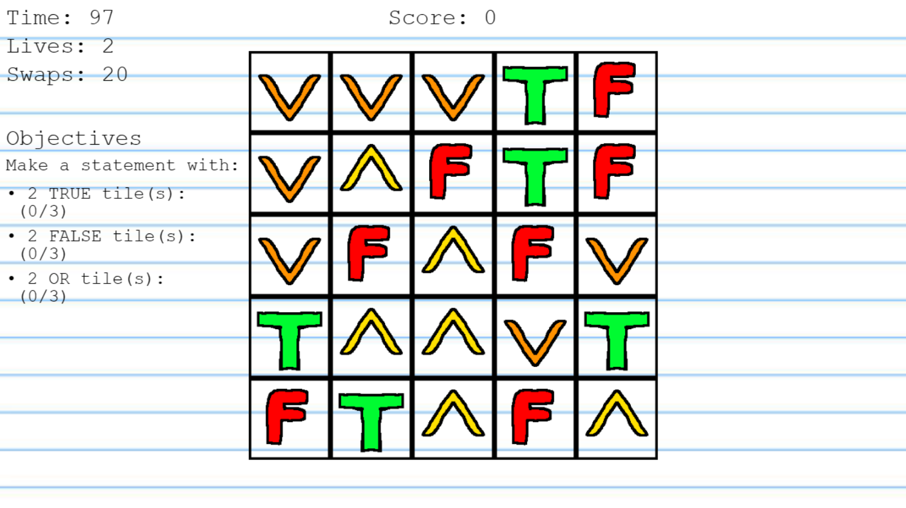

# Game Name

Boolean Bonanza

# Team Color

Teal

# Developers

-   Angelo Ramos (angelora@udel.edu)
-   Patrick Tiamson (pattiam@udel.edu)

# Blurb

Dive into the exciting world of programming with our interactive puzzle game designed to make learning fun! Master the essential coding skill of boolean expressions as you solve engaging challenges that stimulate your mind. Perfect for beginners and experienced coders alike, our game transforms complex concepts into easy-to-understand, enjoyable puzzles. Whether you're looking to boost your programming skills or just love a good brain teaser, this game is your gateway to coding mastery. Ready to code and play your way to success? Join us and turn learning into an adventure!

# Basic Instructions

### Objective

-   Evaluate boolean expressions to `true` to complete objectives

### Controls

-   **Arrow Keys (Up, down, left, right) or WASD Keys**: Swap and move tiles around the board
-   **R Key**: Select a row
-   **C Key**: Select a column
-   **ENTER Key**: Confirm your choice

# Screenshot

# Gameplay Video

https://drive.google.com/file/d/1C1m25t_aci_TQ4Rk8dyEPvJn0G0vVa6e/view

# Educational Game Design Document

Link to our [https://ud-s24-cisc374.github.io/final-project-teal/docs/egdd] (Educational Game Design Document)

# Credits

-   <a href="https://www.vecteezy.com/vector-art/145740-children-drawing-vector">Children Drawing Vector Vectors by Vecteezy</a>
-   <a href="https://www.vecteezy.com/vector-art/6561612-icon-in-hand-draw-style-drawing-with-wax-crayons-children-s-creativity">Icon in hand draw style. Drawing with wax crayons, children&#39;s creativity Vectors by Vecteezy</a>
